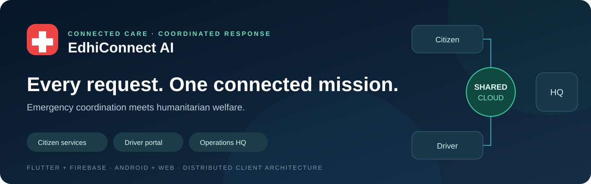
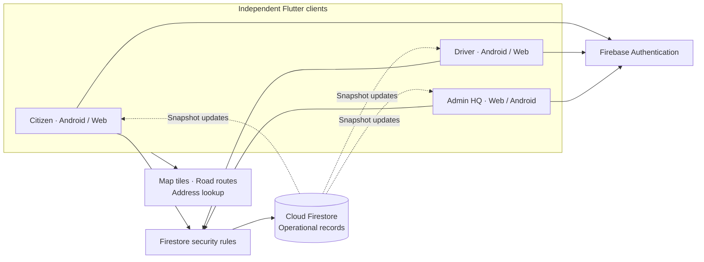

<div align="center">



<br>

[](https://flutter.dev)
[](https://dart.dev)
[](https://firebase.google.com)
[](#get-started)
[](docs/ACCEPTANCE_TESTING_REPORT.md)
[](docs/ACCEPTANCE_TESTING_REPORT.md)

**Emergency response, ambulance coordination and community welfare in one connected platform.**

[Overview](#overview) · [Distributed architecture](#distributed-architecture) · [Get started](#get-started) · [Documentation](#documentation) · [Download Android APK](https://github.com/afanatif/Edhi_fyp/raw/refs/heads/main/EdhiConnect.apk)

</div>

---

## Overview

EdhiConnect AI brings citizens, ambulance drivers and headquarters operators into a shared operational system. Citizens report emergencies and welfare needs; drivers receive their linked ambulance's missions; HQ coordinates requests, vehicles, registered drivers, donations and missing-person reports.

Built with Flutter and Firebase, the platform combines a responsive interface with authenticated cloud records, map-based location selection, explainable triage and transaction-based dispatch. Each portal receives asynchronous updates from the same records, keeping the response connected across Android devices and web sessions.

| Citizen portal | Driver portal | Admin HQ |
| --- | --- | --- |
| Emergency reporting and journey tracking | Assigned ambulance and mission dashboard | Dispatch queue and operational map |
| Current location and map pin selection | Mission details and navigation actions | Create ambulances and assign registered drivers |
| Phone or CNIC with password | Phone or CNIC with password | Fleet availability and linked-account management |
| Donations with optional campaigns and photos | Arrival and completion workflow | Donation review and welfare coordination |
| Blood donor directory and urgent needs | Contact actions for assigned missions | Blood bank, users and operational reports |
| Missing-person reports with images and details | Shared mission state | Searchable missing-person records and photo viewer |
| First aid, contacts and center directory | Role-based access | Verification, activity history and oversight |

## Distributed architecture

EdhiConnect AI uses independent Flutter clients connected to managed cloud services. Firebase Authentication establishes identity, Firestore stores operational state, and security rules authorize each request. HQ, citizen and driver interfaces maintain their own local view while subscribing to the shared cloud records.



The coordination logic protects relationships across records. A dispatch reserves the incident and ambulance together; driver assignment maintains a unique account-to-unit claim; completion closes the mission and releases its unit in the same transaction. Shared journey geometry and timestamps provide a consistent map view across portals.

The architecture combines **transactional state changes** with **asynchronous read propagation**. It is a distributed client/cloud system with a central managed data authority. See the [distributed-system design](docs/DISTRIBUTED_SYSTEM_ARCHITECTURE.md) for sequences, invariants, concurrency and data ownership.

## Core workflows

### Emergency coordination

1. Sign in, choose an emergency category and confirm the patient location on the map.
2. Submit a description and contact details.
3. The triage service attaches a priority, duplicate indicators and explainable risk factors.
4. HQ reviews the queue and coordinates an available ambulance.
5. Citizen, driver and HQ views follow the shared mission through arrival and completion.

### Ambulance and driver management

1. A driver registers an employee account.
2. HQ opens **Fleet operations → Registered drivers**.
3. The operator creates an ambulance or selects an available unassigned unit.
4. A parking point is chosen by dropping a map pin.
5. The assignment transaction links the account and unit; the driver's portal then displays that ambulance.

### Community welfare

- **Donations:** monetary, ration and clothing records, optional campaign selection, material pickup information, photo attachments and HQ review.
- **Blood bank:** blood-group and city discovery, donor availability and urgent blood needs.
- **Missing persons:** image, identifying details, last-seen information and contact details, with a full HQ review panel.
- **Quick help:** first-aid information, emergency contact actions and the Edhi center directory.

## Technology

| Layer | Implementation |
| --- | --- |
| Interface | Flutter, Material widgets, responsive shells and Provider |
| Identity | Firebase Authentication; phone/CNIC username aliases; private role profiles |
| Shared data | Cloud Firestore, snapshot listeners and transactions |
| Authorization | Firestore and Storage security rules |
| Maps | `flutter_map`, OpenStreetMap tiles, OSRM road geometry and Nominatim address lookup |
| Device services | Geolocator, image picker and URL launcher |
| Images | Validated, resized PNG previews stored as bounded Firestore attachments |
| Decision support | Deterministic triage, duplicate matching and explainable risk scoring |
| Verification | Flutter unit/widget tests and Firebase emulator authorization tests |

## Get started

Use **Flutter 3.44 / Dart 3.12**. Android builds also need an Android SDK and a JDK compatible with the checked-in Gradle configuration. Node.js is used for the Firebase tooling.

```bash
git clone https://github.com/afanatif/Edhi_fyp.git
cd Edhi_fyp
flutter pub get
flutter run -d web-server --web-hostname 127.0.0.1 --web-port 8080
```

Open [http://localhost:8080](http://localhost:8080). Register a citizen or driver account and sign in using **CNIC + password** or **Phone + password**. HQ uses a provisioned administrator account. The [Firebase setup guide](docs/FIREBASE_SETUP_GUIDE.md) covers configuration, account provisioning and rule deployment.

For Android:

```bash
flutter devices
flutter run -d YOUR_ANDROID_DEVICE_ID
```

The Android application ID is `com.eeedhi`. Use separate browser profiles or devices when reviewing several roles together.

## Verify and build

```bash
flutter analyze
flutter test
flutter build web --release
flutter build apk --release
```

Security-rule checks use a local Firebase emulator project:

```bash
npm ci --prefix tools/firebase-rules
npx --prefix tools/firebase-rules firebase emulators:exec --only firestore,storage --project demo-edhi-pdf "node tools/firebase-rules/rules.test.mjs"
```

The recorded verification baseline is **141 Flutter tests and 44 emulator rule tests passed**, with a clean Flutter analyzer. See the [acceptance report](docs/ACCEPTANCE_TESTING_REPORT.md) for coverage and reproduction commands.

## Android download

[**Download EdhiConnect.apk**](https://github.com/afanatif/Edhi_fyp/raw/refs/heads/main/EdhiConnect.apk)

The repository includes the Android package alongside the source. Build instructions, package identity and artifact verification are in [Build and deployment](docs/BUILD_AND_DEPLOYMENT.md).

## Repository map

```text
lib/
  core/          Theme, shared widgets, maps and attachment UI
  data/          Directory and fleet data
  features/      Citizen, driver, authentication and HQ screens
  models/        Typed operational records
  routing/       Portal navigation
  services/      Identity, data, triage, routes, location and photos
android/         Android platform project and Gradle wrapper
ios/             iOS platform source
web/             Web entry point, manifest and icons
test/            Flutter unit and widget checks
tools/           Firebase rule checks and administration utilities
functions/       Retained authentication service and its tests
docs/            Architecture, operations, schema and setup guides
EdhiConnect.apk  Android deliverable
```

## Documentation

Start with the [documentation index](docs/README.md).

| Guide | What it covers |
| --- | --- |
| [Project overview](docs/PROJECT_DOCUMENTATION.md) | Scope, portals, modules and engineering structure |
| [Distributed system](docs/DISTRIBUTED_SYSTEM_ARCHITECTURE.md) | Client/cloud topology, transactions and asynchronous updates |
| [Master technical guide](docs/COMPREHENSIVE_FYP_MASTER_DOCUMENTATION.md) | End-to-end design, workflows, data and implementation |
| [Database schema](docs/DATABASE_SCHEMA.md) | Collections, relationships, fields and access ownership |
| [User and admin guide](docs/USER_AND_ADMIN_GUIDE.md) | Registration, dispatch, fleet linking and welfare operations |
| [Firebase setup](docs/FIREBASE_SETUP_GUIDE.md) | Project configuration, rules and HQ provisioning |
| [Build and deployment](docs/BUILD_AND_DEPLOYMENT.md) | Localhost, Android packaging, hosting and artifact checks |
| [Identity, location and photos](docs/LOGIN_LOCATION_AND_PHOTO_UPDATES.md) | Identifier aliases, map selection and image attachments |
| [Ambulance coordination](docs/ambulance-tracking-and-policy.md) | Fleet relationships, lifecycle and shared map state |
| [Acceptance report](docs/ACCEPTANCE_TESTING_REPORT.md) | Verification evidence and regression coverage |
| [Walkthrough](docs/DEMONSTRATION_SCRIPT.md) | A complete citizen, driver and HQ review sequence |
| [Implementation record](docs/Changes-implementation.md) | Feature changes and their source locations |

## Contributing

See [CONTRIBUTING.md](CONTRIBUTING.md) for setup, change conventions and validation. [SECURITY.md](SECURITY.md) describes data ownership and credential handling. [CHANGELOG.md](CHANGELOG.md) records the published feature set.

## Project credits

Development credits: **Muhammad Usman Waqar Khan**, **Abdullah Sajid** and **Daniyal Murtaza**. Supervision: **Muneeba Firdous**. Repository maintained by [Afan Atif](https://github.com/afanatif).

---

<div align="center"><strong>Connect the request. Coordinate the response. Support the community.</strong></div>
