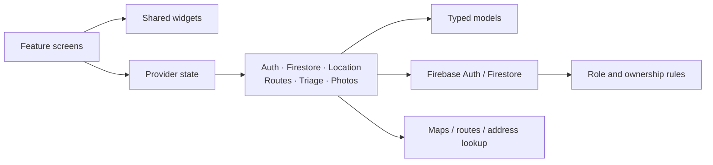

# EdhiConnect AI — master technical documentation

## 1. Platform summary

EdhiConnect AI brings emergency coordination and humanitarian welfare into one role-based application. Citizens submit needs, drivers work through linked ambulances and HQ coordinates the shared queue and inventory. Flutter supplies Android and web interfaces; Firebase supplies authentication, persistent operational documents and authorization.

The design is organized around three connected ideas: a stable account identity, an explicit incident lifecycle and a transactionally maintained relationship between an incident and its assigned unit.

## 2. Objectives

| Objective | Application behavior |
| --- | --- |
| Connect the citizen to HQ | An authenticated incident includes location, category, description and contact context |
| Coordinate scarce response resources | Available units are selected and reserved through the dispatch workflow |
| Give drivers an operational workspace | An HQ-controlled assignment links the registered account to a unit |
| Keep portals synchronized | Role-specific listeners consume shared cloud records |
| Make review explainable | Priority, duplicate context and risk reasons accompany the incident |
| Support welfare coordination | Donations, blood needs and missing-person reports use the same account platform |
| Preserve ownership | Firebase identity and rules govern personal and operational access |
| Make changes reviewable | Typed models, explicit services, rules and regression suites document behavior |

## 3. Actors and responsibilities

### Citizen

The citizen supplies identifying/contact information, chooses the patient location and submits the incident. They follow the mission, use eligible lifecycle actions, contribute donations and maintain their welfare submissions.

### Driver

The driver registers an employee account and receives an HQ unit assignment. Their portal presents the linked ambulance, current mission, patient context and supported navigation/contact/completion actions.

### Headquarters operator

The operator provisions and manages the operational fleet, links personnel, reviews incident context, dispatches eligible resources and reviews welfare records. HQ also sees account administration, activity and summary views.

### Cloud services

Firebase Authentication verifies the password and provides the UID. Firestore persists shared records and coordinates transactional writes. Rules evaluate whether an authenticated request is permitted.

### Geographic services

Device positioning, map tiles, address lookup and road routing support the chosen point and journey presentation. Geographic input is stored with the associated incident or unit rather than replacing its cloud identity.

## 4. Functional requirements

| ID | Requirement | Main implementation |
| --- | --- | --- |
| ID-01 | Register citizen and driver profiles | AuthService and registration form |
| ID-02 | Accept phone/CNIC usernames with one password | Identifier aliases and Firebase Auth |
| ID-03 | Route active users to their portal | Auth wrapper and role profile |
| ER-01 | Submit a located, described emergency | Citizen home and location picker |
| ER-02 | Attach priority and review context | AITriageService |
| ER-03 | Coordinate incident/unit assignment | FirestoreService transaction |
| ER-04 | Track shared mission stages | Tracking view, driver view and HQ |
| ER-05 | Close a mission and release its unit together | Lifecycle transactions and rules |
| FL-01 | Create an ambulance with vehicle details | HQ fleet workflow |
| FL-02 | Assign a registered driver uniquely | Driver panel and driver-link claim |
| FL-03 | Choose parking location with a map pin | Shared map location picker |
| FL-04 | Show available, busy and offline units | HQ fleet filters and counts |
| WF-01 | Submit donations with optional campaign | Donation form and model |
| WF-02 | Attach a photo to relevant welfare records | Photo picker, codec and attachments |
| WF-03 | Maintain blood donor availability and needs | Blood-bank screens and service |
| WF-04 | Publish missing-person details and photo | Missing-person form and bulletin |
| WF-05 | Present missing-person records in HQ | AdminMissingPersonsView |
| SP-01 | Provide contact and first-aid actions | Quick-help feature |
| SP-02 | Provide presentation preferences | AppPreferencesService |
| QA-01 | Check behavior and authorization | Flutter and emulator suites |

## 5. Architecture and dependencies

The presentation layer is arranged by portal and feature. Common widgets centralize map interactions, photo selection, status display and responsive shells. Services expose operations and observable state. Models parse and serialize cloud documents.

The client/cloud topology is distributed across separate devices and network services. Firestore is the common data authority. Atomic writes establish operational relationships; listeners propagate the committed result to each client. See the dedicated [distributed-system design](DISTRIBUTED_SYSTEM_ARCHITECTURE.md).

## 6. Identity design

The user-facing identifier is not required to be an email address. A citizen or driver can select CNIC or phone on login. AuthService normalizes the input, reads its exact alias and uses the resulting authentication address with the supplied password.

Registration creates an opaque authentication address. A transaction then writes the private profile, phone claim and both aliases. A phone claim is tied to the same UID; alias creation is tied to the Auth token email and the profile being committed.

Private profiles contain role and activation state. A user-owned profile update cannot change the role. Administrator accounts are established by the management utility with the matching active administrator profile.

Passwords belong to Firebase Authentication and are not serialized into Firestore documents.

## 7. Emergency data and lifecycle

An incident includes the request ID, owner UID, citizen display/contact context, emergency category, description, patient point and timestamps. Decision-support fields carry priority, duplicate indicators, risk level/reasons and verification.

Supported stored states include pending, approved, assigned, in progress, arrived, completed and cancelled. The interface presents a compact progress sequence. A dispatch can move directly to the travelling stage after reservation.

Arrival and completion are distinct. A completed incident releases the unit; an arrived incident is still part of the current response until completion. Eligible cancellation is evaluated against the original request creation and server policy.

Terminal operations compare the unit's active request ID. That comparison prevents a stale operation on one incident from freeing a unit now serving another incident.

## 8. Priority, duplicates and risk review

AITriageService uses deterministic application rules. It matches descriptions and context to the labels Critical P1, Urgent P2 and Standard P3. The output can be inspected and tested against explicit fixtures.

Duplicate detection compares recent incident context using geographic distance and time proximity. It records the related request rather than silently removing the new submission.

Risk scoring combines explainable signals such as suspicious description patterns, repeated submissions and location/contact context. The normalized score maps to Low, Medium or High review levels. High-risk incidents enter the review path before automatic dispatch eligibility.

Operator review remains visible through verification state and activity. Decision-support data enriches the queue; it does not replace the operator's incident assessment.

## 9. Dispatch coordination

The queue ranks relevant requests by priority and eligibility. Unit eligibility considers operational state and valid geographic position. Route calculations provide road distance/geometry and travel context for the selected pair.

The dispatch transaction reads the current request and unit, checks their state and writes the assignment and reservation together. A unit with an active mission cannot be selected as free by a competing transaction through this workflow.

When no eligible unit is available, the request remains queued. A released unit can trigger queue processing. Manual dispatch and automatic queue processing use the same service-level operational checks.

## 10. Fleet model and driver relationships

A user profile represents a registered account. An employee record represents an operational ambulance and its personnel association. A driver-link document represents the unique account claim.

HQ can create a unit independently or create it while assigning a selected driver. The unit stores vehicle number/model, center association, status, active incident and map position. Linked name/phone data is drawn from the registered profile.

Assigning an existing unit checks the driver's active state, existing claim and target unit's availability for linkage. Busy units are protected. This model avoids treating every registration as a vehicle and lets HQ maintain explicit fleet inventory.

## 11. Location and route presentation

LocationService requests device position and resolves a readable address. The home view shows the resulting location and refresh action. Emergency selection uses a map point that the citizen confirms.

The shared map picker also supports fleet parking. The user can drop a pin instead of entering latitude/longitude manually. HQ staging coordinates can be aligned with a nearby road through RouteService.

Journey records contain geometry, timing and pause/stop controls tied to the unit and incident. RoutePlayback measures distance along the path and derives position and heading from the shared state. HQ, citizen and driver views therefore consume the same journey inputs.

## 12. Welfare design

### Donations

Donation records distinguish monetary, ration and clothing types. Campaign association is optional. Notes and pickup context describe material contributions; relevant records can include a photo. Monetary records carry method/reference and payment-review state.

Owners see their own donation history. HQ reviews shared contribution records and updates the supported processing states.

### Blood bank

Donor records contain group, city, phone and availability. Urgent need records contain group, requested units and contact/location context. Active users can search and coordinate using the recorded information. Owners manage the supported state changes of their submissions.

### Missing persons

A report contains person identity, age, gender, last-seen place/time, distinguishing description, reporting contact, current status and optional image. Reports start as Searching and support Found/Reunited status progression.

HQ displays images and full details in Welfare, with search, filters and an image viewer. The shared record preserves the same reporting contact and case information across portals.

## 13. Photo pipeline

The image picker obtains bytes from camera/gallery. SelectedPhoto identifies JPEG, PNG or WebP from the file data and checks the input size. PhotoCodec decodes, resizes and re-encodes a PNG preview, removing source metadata.

The prepared preview is stored as Firestore bytes with owner, kind, MIME type and server creation time. Parent documents hold a reference using the `firestore-photo:` prefix. StoredPhoto resolves that reference and renders the attachment.

Missing-person images are available through exact reads to active users; donation attachments are available to the owner and HQ. Attachments are immutable; replacement creates another prepared reference.

## 14. Supporting modules

- Quick help contains first-aid pages, contact actions and the center directory.
- Emergency contact messaging opens a prepared device composer for the user to send.
- Notifications maintain an in-app inbox and foreground Firebase-message handling.
- Preferences expose text scale and high-contrast presentation options.
- HQ user administration manages account state.
- Operational reports summarize records consumed by the service.
- Audit events capture application actions for HQ review.

Each supporting module has its own access policy and UI boundary. Consult the source and rule file when extending it.

## 15. Authorization model

The main rule helpers establish signed-in identity, active profile, HQ role, owner relationship and driver assignment.

New incidents require owner identity, initial pending state and a server creation timestamp. Owner and driver lifecycle writes are restricted to selected fields. Completion checks that the related unit is released in the same committed operation.

Profile updates preserve role ownership. Welfare writes validate their relevant fields and ownership. Photos validate size/type and expose exact reads according to kind. Unknown collection paths have no broad permissive rule.

Current access policies are maintained in [firestore.rules](../firestore.rules) and [storage.rules](../storage.rules), with direct-client authorization fixtures in the emulator suite.

## 16. State and session management

Provider services expose collections and operation state to widgets. bindSession switches the operational subscriptions according to the current active profile. Account changes clear the previous private view and stop session-specific work.

Network errors produce service state that the UI can show. The request flow distinguishes a local pending submission from a confirmed cloud incident. Retry handling belongs to the operational service rather than the screen fabricating an accepted assignment.

## 17. Verification and delivery

The documented baseline contains 141 passing Flutter checks and 44 passing Firebase rule checks, with a clean analyzer. Flutter checks cover models, decision logic, service behavior and widgets; emulator checks cover direct authorization and related-record transitions.

Android and web builds have been produced from the current application baseline. The repository includes the Android artifact, source, rules, platform wrappers and documentation. Build caches and private runtime data remain local.

Use the [acceptance report](ACCEPTANCE_TESTING_REPORT.md) to reproduce checks and the [build guide](BUILD_AND_DEPLOYMENT.md) to reproduce artifacts.

## 18. Maintenance references

| Task | Guide |
| --- | --- |
| Understand every collection | [Database schema](DATABASE_SCHEMA.md) |
| Configure cloud services | [Firebase setup](FIREBASE_SETUP_GUIDE.md) |
| Operate the portals | [User and admin guide](USER_AND_ADMIN_GUIDE.md) |
| Review concurrency | [Distributed architecture](DISTRIBUTED_SYSTEM_ARCHITECTURE.md) |
| Review source mappings | [Changes and implementation](Changes-implementation.md) |
| Present the whole workflow | [Walkthrough](DEMONSTRATION_SCRIPT.md) |
| Contribute changes | [Contribution guide](../CONTRIBUTING.md) |
| Handle credentials and reports | [Security guide](../SECURITY.md) |
