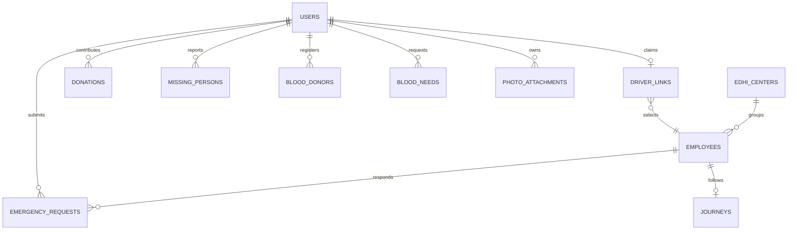

# Database schema

Cloud Firestore stores the shared operational records. Firebase Authentication stores password credentials and provides UIDs. This guide describes the principal application fields and relationships; model serializers and [firestore.rules](../firestore.rules) define the implementation.

## 1. Relationships

`JOURNEYS` in the diagram corresponds to the existing `route_demos` collection. `employees` stores operational ambulance units and their assigned personnel.

## 2. Identity collections

### users/{uid}

| Field | Type | Meaning |
| --- | --- | --- |
| `id` | string | Firebase UID |
| `name` | string | Display name |
| `email`, `authEmail` | string | Stored authentication identity |
| `cnic` | string | Formatted CNIC identifier |
| `phone` | string | Normalized Pakistani mobile number |
| `role` | string | `user`, `employee` or `admin` |
| `address` | string | Profile address |
| `profileImage` | string | Image reference |
| `isActive` | boolean | Account activation state |
| `createdAt` | timestamp | Creation time |
| `fcmToken`, `fcmTokens`, `updatedAt` | optional | Messaging/profile maintenance fields |

An account can read its own profile. HQ can read and manage profiles. User-owned updates are restricted to the explicitly permitted profile fields; a user cannot promote their own role.

### login_aliases/{identifier}

Identifier forms are `cnic_<digits>` and `phone_<normalized-number>`. Each document contains only `authEmail`, an opaque address identifying the Firebase Auth account.

Exact `get` reads support pre-login identifier resolution. Listing is denied. Alias creation is tied to the signed-in account and the profile written during registration.

### phone_claims/{phone}

Contains `userId`. The normalized phone is the document ID. Registration reads this claim and commits it with the profile and aliases, making duplicate-number handling part of the same transaction.

### driver_links/{uid}

Contains `employeeId`. HQ maintains the unique claim linking a driver account to a unit. The driver can read their own claim; administrative workflows create, update and remove claims.

## 3. Emergency collections

### emergency_requests/{requestId}

Source: [EmergencyRequest](../lib/models/emergency_request.dart).

| Field group | Fields |
| --- | --- |
| Identity | `requestId`, `userId`, `userName`, `userPhone` |
| Incident | `emergencyType`, `description` |
| Patient location | `location.latitude`, `location.longitude`, `location.address` |
| Lifecycle | `status`, `createdAt`, `updatedAt` |
| Priority | `priority` |
| Duplicate context | `isDuplicate`, `duplicateOfRequestId` |
| Assignment | `assignedEmployeeId`, `assignedEmployeeName` |
| Review | `fraudRiskScore`, `fraudRiskLevel`, `fraudReason`, `isVerified` |

Stored statuses: `Pending`, `Approved`, `Assigned`, `InProgress`, `Arrived`, `Completed`, `Cancelled`. Priority labels: `Critical P1`, `Urgent P2`, `Standard P3`.

HQ, the owner and the assigned driver have incident read access. Creation requires the authenticated owner, a pending state, no assignment and a server creation timestamp. Owner and driver transitions are narrowed by field, lifecycle and related-unit checks.

### emergency_usage/{uid}

Fields: `cancellationCount` (integer), `windowStartedAt` (timestamp), `banStartedAt` (nullable timestamp), `lastCancelledRequestId` (string).

The owner and HQ can read the relevant record. Updates are accepted as part of the validated cancellation operation. Clients cannot independently clear the usage history.

## 4. Fleet collections

### employees/{employeeId}

Source: [Employee](../lib/models/employee.dart).

| Field | Type | Meaning |
| --- | --- | --- |
| `employeeId` | string | Unit document identity |
| `userId` | string | Linked driver UID; empty for an unassigned unit |
| `name`, `phone` | string | Assigned personnel details |
| `role` | string | Operational personnel role |
| `vehicleNumber`, `vehicleModel` | string | Vehicle details |
| `assignedCenterId` | nullable string | Center association |
| `status` | string | `available`, `busy` or `offline` |
| `activeRequestId` | string | Current incident; empty when released |
| `currentLat`, `currentLng` | number | Unit map position |
| `speedKmh` | integer | Displayed speed |
| `batteryFuel` | integer | Readiness field; model uses a sentinel when unspecified |
| `locationUpdatedAt` | nullable timestamp | Position timestamp |
| `transitRunnerSession` | nullable string | Journey coordination session |
| `transitLastHeartbeat` | nullable number | Millisecond heartbeat time |

The serializer also includes journey configuration metadata. Consult the model for the complete serialized record.

Active accounts can read unit records. HQ manages creation and assignment. Driver-owned writes are restricted to allowed operational fields and related lifecycle checks.

### route_demos/{employeeId}

Shared journey fields include `requestId`, `userId`, `driverUserId`, `points`, `startedAt`, `durationSeconds`, `speedFactor`, `enabled`, `pausedAt` and `stoppedAt`.

Each point is a `{lat, lng}` pair. The unit ID identifies the journey document; `requestId` identifies the incident being followed. HQ controls journey records. Citizen and driver reads are scoped to their journey; permitted terminal updates can stop the current route.

### edhi_centers/{centerId}

Fields: `centerId`, `name`, `address`, `contact`, `city`, `ambulanceCount`, `services`, optional `latitude`, `longitude`, `sourceUrl` and `verifiedOn`.

The app combines the bundled center directory with cloud records. Operational fleet totals come from unit records, while directory metadata describes centers.

## 5. Welfare collections

### donations/{donationId}

Source: [Donation](../lib/models/donation.dart).

Fields: `donationId`, `userId`, `userName`, `amount`, `donationType`, `status`, `notes`, `campaign`, `photoUrl`, `paymentMethod`, `transactionReference`, `paymentStatus`, `createdAt`.

Types are `monetary`, `ration` and `clothing`. Campaign can be empty. A photo is optional. Owners read their donations; HQ reads and reviews all donation records. Creation starts in `Pending`.

### missing_persons/{reportId}

Source: [MissingPersonReport](../lib/models/missing_person_report.dart).

Fields: `reportId`, `userId`, `personName`, `age`, `gender`, `lastSeenLocation`, `lastSeenAt`, `description`, `contactName`, `contactPhone`, `status`, `reportedAt`, `photoUrl`.

Statuses are `Searching`, `Found` and `Reunited`. The form accepts an optional image and validates identifying/contact information. Rules require valid age, a nonfuture last-seen timestamp and an initial searching state. Active accounts can view reports. Owners can make the supported found/reunited transitions; HQ has administrative rule access.

### photo_attachments/{photoId}

| Field | Type |
| --- | --- |
| `userId` | string |
| `kind` | `missing_persons` or `donations` |
| `contentType` | `image/png` |
| `image` | Firestore bytes |
| `createdAt` | server timestamp |

Parent `photoUrl` values use `firestore-photo:<photoId>`. The codec stores a re-encoded preview of at most 256 KiB. Attachments are immutable after creation; replacement creates a new reference.

Rules permit exact reads of missing-person images by active accounts, and owner/HQ reads of donation images. Collection listing is denied. Owners and HQ can delete eligible attachments.

### blood_donors/{donorId}

Fields: `donorId`, `userId`, `userName`, `userPhone`, `bloodGroup`, `availability`, `city`, `createdAt`.

Valid groups are A+, A−, B+, B−, AB+, AB−, O+ and O−. Active accounts can read. Owners manage their donor information; HQ has administrative access.

### blood_needs/{id}

Stores request ownership, blood group, units needed, contact/location context and lifecycle fields. Initial status is `active`; the owner can transition to `cancelled`. The exact submitted payload is assembled in [FirestoreService](../lib/services/firestore_service.dart). Units needed must be positive and within the rule-accepted range.

## 6. Supporting collections

| Collection | Main fields / role |
| --- | --- |
| `notifications` | `notificationId`, `userId`, `title`, `message`, `type`, `isRead`, `createdAt`; user/all-recipient inbox records |
| `audit_events` | `id`, `action`, `entityType`, `entityId`, `actorId`, `details`, `createdAt`; HQ activity review |
| `feedback` | `feedbackId`, `userId`, `userName`, `rating`, `comments`, `createdAt` |
| `chat_messages` | `messageId`, `threadId`, `sender`, `message`, `timestamp` |
| `tasks` | `taskId`, `requestId`, `employeeId`, `status`, `notes`, `updatedAt` |
| `auth_login_limits` | Private counters used by the retained server authentication implementation |

These collections have individual rule policies. Activity events are an application log; authorized active clients can create them. Consult the rule file for the precise boundary rather than treating every supporting collection as identical.

## 7. Query and timestamp conventions

- Document IDs provide stable relation keys.
- Server timestamp fields distinguish committed cloud writes from local display time.
- Models accept supported historical timestamp forms while normalizing UI values.
- Role/owner query filters must satisfy rules; rules do not remove unauthorized results from a broad query.
- New query combinations should be verified against the Firestore index requirements produced by the SDK.
- New schema changes must update model serializers, rules, fixtures and affected portal views together.

For setup see [Firebase configuration](FIREBASE_SETUP_GUIDE.md); for concurrency see [Distributed architecture](DISTRIBUTED_SYSTEM_ARCHITECTURE.md).
