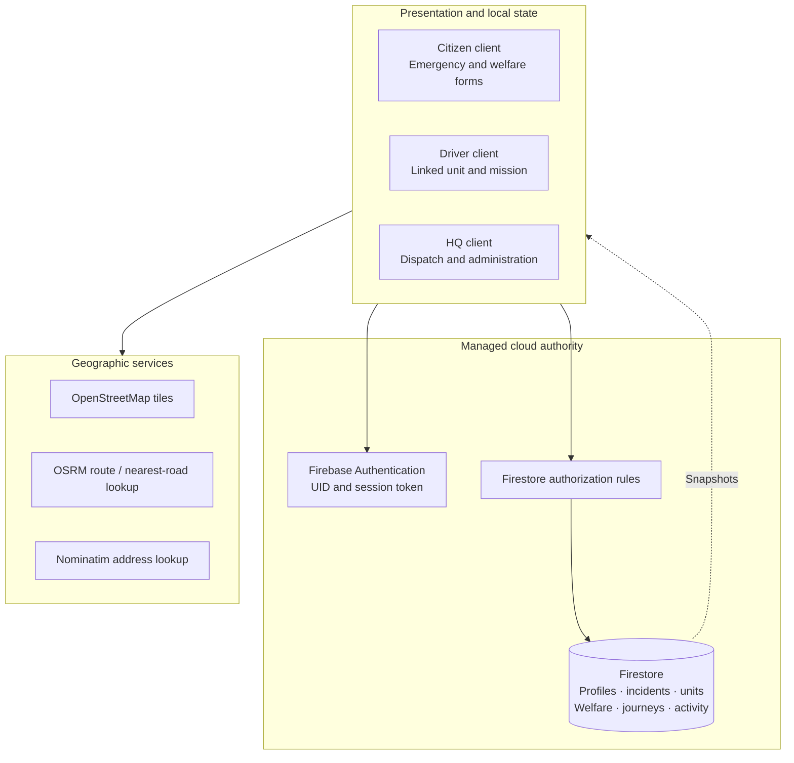
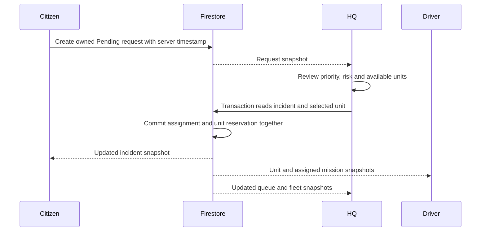

# Distributed-system architecture

EdhiConnect AI coordinates independent citizen, driver and headquarters clients through Firebase Authentication and Cloud Firestore. A mobile device and an HQ browser can operate concurrently, each rendering a local view of the same authenticated cloud records.

This is a distributed **client/cloud architecture**: clients run on different devices and communicate over the network; a managed cloud data authority stores the shared operational state. The application uses transaction-based coordination for related writes and snapshot subscriptions for asynchronous read updates.

## 1. System topology

The Flutter service layer separates identity, persistence, routing, location, photos and triage. Provider exposes service state to the widgets. Navigation follows the authenticated user's private role profile.

## 2. Responsibilities by component

| Component | Responsibility | Main source |
| --- | --- | --- |
| Client interface | Forms, maps, status views and operator actions | [features](../lib/features/) |
| Authentication | Password verification, alias lookup, profile loading and logout | [AuthService](../lib/services/auth_service.dart) |
| Operational service | Queries, fleet linking, dispatch and lifecycle transactions | [FirestoreService](../lib/services/firestore_service.dart) |
| Data authority | Shared documents, durable committed state and transaction processing | [schema](DATABASE_SCHEMA.md) |
| Authorization | Role, ownership, field and cross-record checks | [rules](../firestore.rules) |
| Routing | Road geometry, nearest-road positioning and cached route calculations | [RouteService](../lib/services/route_service.dart) |
| Location | Device position, address resolution and permission state | [LocationService](../lib/services/location_service.dart) |
| Journey view | Position and heading derived from shared route records | [RoutePlayback](../lib/models/route_playback.dart) |
| Images | File validation, resizing and metadata-stripping re-encoding | [PhotoCodec](../lib/services/photo_codec.dart) |

## 3. Identity and trust boundaries

Every authenticated account has a Firebase UID. A private `users/{uid}` profile supplies the portal role and active state. Citizens store `user`, drivers store `employee`, and HQ operators store `admin`.

Phone and CNIC are alternative usernames for the same password-authenticated account. Exact alias reads expose an opaque authentication address. Profile records remain governed by ownership and administrator rules; alias collections cannot be listed by clients.

The UI guides valid actions, while Firestore rules govern accepted writes. Public registration creates citizen or driver profiles. Administrative profile provisioning happens through a trusted management utility.

Firebase client configuration identifies the project. Authorization depends on authenticated identity and rules, rather than secrecy of the web configuration. See [Firebase's API-key guidance](https://firebase.google.com/docs/projects/api-keys).

## 4. Operational invariants

The service coordinates these relationships:

| Invariant | Coordination mechanism |
| --- | --- |
| A registered driver is linked to one unit through the assignment workflow | Unique `driver_links/{uid}` claim read and written in an HQ transaction |
| An ambulance carries one current mission | Unit `activeRequestId` and incident assignment are reserved together |
| A closed mission releases its current unit | Incident terminal status and unit availability change atomically |
| An old request does not release a reassigned unit | The transaction compares the current mission ID before releasing |
| Non-HQ completion concerns the caller's own mission | Ownership/assignment checks plus cross-document rule validation |
| A journey stops alongside an eligible terminal operation | Shared route state is updated with the lifecycle operation |
| A user's cancellation usage accompanies the cancelled incident | Usage record and incident transition are checked together |
| Session changes discard the previous private view | Service subscriptions are rebound to the current profile |

Some invariants are coordinated by the trusted HQ service workflow; others are explicitly cross-checked by rules using `getAfter()`. Read the rule file when assessing a particular operation.

## 5. Dispatch across concurrent HQ sessions

A second HQ session may try to reserve the same unit. The transaction reads the current incident and unit state before writing. Firestore retries transactions affected by concurrent changes; the application re-evaluates eligibility and proceeds only with a valid pair. Related writes commit together. See [Firestore transactions](https://firebase.google.com/docs/firestore/manage-data/transactions).

Network work such as route calculation is handled outside the database reservation callback. Transaction callbacks should remain safe to rerun.

## 6. Driver-account assignment

The driver registration profile and the ambulance record represent different entities. Registering an account establishes identity; HQ assignment establishes the operational unit.

The assignment transaction reads the selected driver, the unique driver-link document and the target unit. It checks that the driver is active, the account is not already linked through another claim, and the unit is eligible. It then writes the link and the unit's account association together.

Creating a unit and assigning the selected driver follows the same principle. The parking pin supplies the geographic starting point; registered profile data supplies the driver's name and phone.

## 7. Lifecycle and atomic release

Incident records support `Pending`, `Approved`, `Assigned`, `InProgress`, `Arrived`, `Completed` and `Cancelled`. The selected dispatch path may advance directly into `InProgress` once the pair is reserved.

Completion reads the incident and unit together. If the request is arrived and still belongs to that unit, it closes the incident, clears `activeRequestId`, makes the unit available and sets its speed to zero. Repeating an already-finished operation is handled without releasing a later mission.

Cancellation uses the original request timestamp and server-authorized eligibility. Assignment does not restart eligibility. The service combines the incident update, usage accounting, eligible unit release and journey stop into one transaction.

## 8. Snapshot propagation and local state

Clients subscribe to queries relevant to their roles. HQ consumes the administrative queue and fleet view; citizens see their requests and donation records; driver views follow the linked unit and mission.

A listener first establishes a view and then receives document changes. Different devices can receive a commit at different moments. The UI rebuilds from the new snapshots rather than assuming all devices update at once. See [Firestore listeners](https://firebase.google.com/docs/firestore/query-data/listen).

Provider services maintain local collections for rendering. Session binding starts the appropriate subscriptions, and logout or an account change clears the previous private state. Connection errors are translated into user-facing service state; request retries preserve the distinction between a local pending submission and a cloud-confirmed incident.

## 9. Time, ordering and journey state

Cloud timestamps anchor committed lifecycle operations. Server checks use the server request time; user-visible labels convert timestamps for display.

Shared journey documents contain road points, a start time, duration, speed factor and pause/stop information. Each portal can calculate distance-weighted position along the same geometry. The resulting map view is tied to the same incident ID and unit ID.

HQ reconciliation handles arrival through the operational service. A stopped journey remains frozen; it does not imply that the vehicle is free. Availability follows the mission state transaction.

## 10. Geographic services and caching

The application combines device location with human-readable address lookup and map pin selection. Patient selection and fleet parking selection share map widgets.

RouteService requests road geometry and caches route calculations. HQ parking selection can align a staging point to a nearby road. Geography is presentation and planning input; authentication and mission ownership remain in Firebase.

## 11. Welfare records across portals

Missing-person reports are shared with active users and HQ. Photos are separately stored as bounded attachment documents and loaded through exact document references. Donation records and their attachments use owner/HQ access.

A photo is prepared before its parent record is submitted. Attachment storage and parent submission are distinct operations; the reference connects them. The interface surfaces submission success after the parent write succeeds.

## 12. Verification strategy

Flutter checks cover model parsing, queue decisions, assignment behavior, lifecycle transitions, maps, attachment handling and portal rendering. Emulator tests exercise authorization with several identities, including direct writes that bypass widgets.

The design is documented through code links, operation sequences and invariants, with the current verification baseline in the [acceptance report](ACCEPTANCE_TESTING_REPORT.md).
