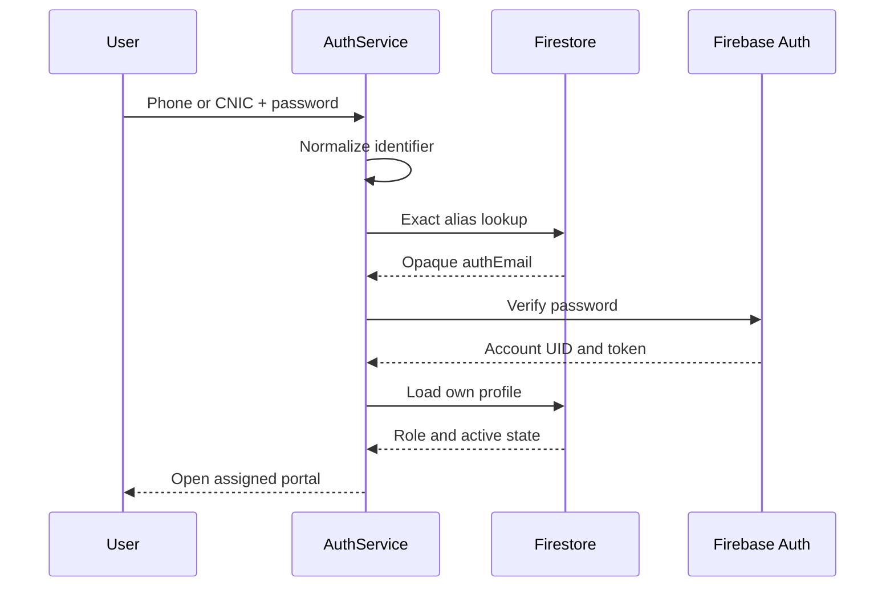
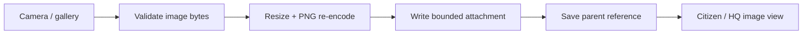

# Identity, location and photo implementation

This guide explains three shared workflows: identifier-based password login, map-based location selection and welfare attachments.

## 1. Phone and CNIC login

The login interface exposes a CNIC/Phone switch. The chosen identifier is normalized and resolved through an exact `login_aliases` read. The alias contains only the opaque Firebase authentication address.

Firebase Authentication verifies the supplied password. AuthService then loads the private profile and uses its role/active state for portal routing.

Phone is a username for the existing password account. CNIC and phone share one UID, profile and role.

### Registration

Registration creates the Authentication account and commits the profile, phone claim and two aliases together. Normalization makes alternate formatting resolve to the same intended identifier.

Private profiles cannot be read broadly before authentication. Alias listing is denied. User-owned updates preserve administrative role fields.

Sources: [AuthService](../lib/services/auth_service.dart), [AppUser](../lib/models/app_user.dart), [login screen](../lib/features/auth/login_screen.dart), [registration](../lib/features/auth/register_screen.dart).

## 2. Driver registration and HQ linking

A driver registration creates an employee-role user profile. HQ manages its unit association through the registered-driver panel.

Assignment reads the active profile, driver claim and target unit before committing the unit's `userId` and `driver_links/{uid}`. Creating and assigning a unit uses the same claim logic. Registered-driver rows show unlinked, linked and inactive account context.

Sources: [registered-driver panel](../lib/features/admin/fleet/registered_drivers_panel.dart), [FirestoreService](../lib/services/firestore_service.dart).

## 3. Actual current location in the home view

The greeting area uses a current-location display. The action requests permission when needed and refreshes the device position and readable address. Movement and refreshed service state update the displayed location.

The UI distinguishes an acquired device position from a point manually chosen on the map. It does not treat an unconfirmed map starting point as a confirmed patient location.

Sources: [current location widget](../lib/core/widgets/current_location_display.dart), [LocationService](../lib/services/location_service.dart), [citizen home](../lib/features/user/home/user_home_screen.dart).

## 4. Map pin selection

Patient selection and ambulance parking selection use map interfaces. Users move/drop the point and confirm it visually.

| Context | Selection purpose |
| --- | --- |
| Patient | Where help should be sent |
| Ambulance parking | Where the unit is staged |
| Center/navigation | Where a directory or contact action opens |

Road alignment can refine a parking point through OSRM nearest-road lookup. The selected coordinates remain implementation data; the operator works with the map and place display.

Sources: [map picker](../lib/core/widgets/map_location_picker.dart), [patient picker](../lib/core/widgets/location_picker_sheet.dart), [RouteService](../lib/services/route_service.dart).

## 5. Photo selection and preparation

The optional photo field offers camera/gallery actions and a preview. Users can replace or remove a selected image.

SelectedPhoto recognizes supported formats from file bytes and accepts inputs up to 5 MB. PhotoCodec prepares a resized PNG of at most 256 KiB. Re-encoding removes source metadata.

The service writes a `photo_attachments` document with `userId`, `kind`, `contentType`, `image` and `createdAt`. The parent record stores `firestore-photo:<id>` as its image reference.

Sources: [photo picker](../lib/core/widgets/photo_picker_field.dart), [SelectedPhoto](../lib/models/selected_photo.dart), [PhotoCodec](../lib/services/photo_codec.dart), [StoredPhoto](../lib/core/widgets/stored_photo.dart).

## 6. Missing-person photos and HQ details

The form combines identifying details, last-seen place/time, description, contacts and optional image. HQ consumes the same shared report records.

The HQ view includes a thumbnail, searchable details, status filters and an expandable image view. It preserves the reporting contact and case metadata for coordination.

Sources: [form](../lib/features/user/missing_persons/missing_person_form.dart), [HQ view](../lib/features/admin/missing_persons/admin_missing_persons_view.dart).

## 7. Clothing and other donation attachments

Relevant donation records can include the selected photo. Campaign association is optional. The form stores item notes and material pickup context alongside the image reference.

Donation records and attachments are scoped to the donor and HQ for reading. Missing-person images follow the active-user bulletin policy.

Source: [donations screen](../lib/features/user/donations/donations_screen.dart).

## 8. Regression coverage

The identity checks cover normalization, alias-based login and wrong-password handling. Requested-update checks cover the login toggle, location presentation, optional campaigns and image fields. Photo tests check format recognition and bounded re-encoding. Registered-driver and HQ missing-person checks cover linkage and case presentation.

See [Acceptance testing](ACCEPTANCE_TESTING_REPORT.md) for commands and evidence, and [Database schema](DATABASE_SCHEMA.md) for exact record ownership.
