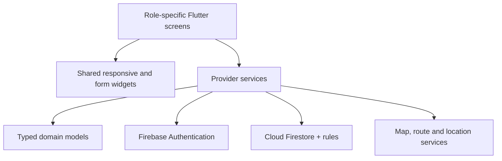

# EdhiConnect AI — project documentation

## Purpose

EdhiConnect AI connects emergency response and humanitarian services through a shared digital platform. It gives citizens a place to request help, drivers a mission workspace and HQ a coordinated view of incidents, ambulances, personnel and welfare records.

The project uses Flutter for the client application and Firebase for identity and shared cloud data. Android and web use the same domain models and service layer, with layouts adapted to mobile and desktop screens.

## Portal responsibilities

| Portal | Primary responsibilities |
| --- | --- |
| Citizen | Register and sign in, choose a patient location, request an ambulance, follow the mission, contribute donations, register blood availability and report missing persons |
| Driver | Sign in to a registered employee account, access the assigned ambulance and mission, open contact/navigation actions and complete the supported mission workflow |
| Admin HQ | Review and dispatch incidents, create units, assign registered drivers, maintain fleet readiness, review welfare records, administer accounts and examine activity |

A driver account becomes operational when HQ assigns it to an ambulance. The identity profile and the fleet record stay separate so HQ can manage personnel and vehicle inventory explicitly.

## Functional scope

### Identity and profiles

Public registration collects a name, CNIC, phone, password, address and portal selection. Phone and CNIC login use the same password and Firebase UID. HQ accounts are created through trusted provisioning and receive an administrator profile.

A normalized phone claim and two identifier aliases are committed with the private profile. Passwords are verified by Firebase Authentication. Role and active-state checks guide routing and cloud access.

### Emergency reporting and dispatch

A citizen chooses an emergency category, describes the situation and selects the patient point. Current-device location can populate the map, and a dropped pin can refine the location. The record includes contact context, priority and review metadata.

HQ sees pending work, current missions, completed requests and unit availability. Dispatch considers priority and eligible units. Incident assignment and ambulance reservation are coordinated transactionally. Releasing a finished unit makes it available for queued work.

### Decision support

AITriageService uses deterministic keyword and context rules to produce priority, potential-duplicate context and explainable risk factors. Operators can inspect the associated reasons when reviewing an incident.

The chatbot provides guided responses and suggested actions through application logic. First-aid content and contact tools connect guidance with practical next actions.

### Fleet operations

HQ can create an ambulance, enter its plate/model, choose a parking point from a map and optionally assign a registered driver. Registered-driver rows expose account linkage, account activation and unit association.

The assignment workflow prevents conflicting claims and protects busy units. Fleet views show available, busy and offline states. Center grouping combines the directory with actual unit associations.

### Shared journey view

Route geometry and shared timestamps provide mission position, heading and progress across portal maps. HQ can inspect the selected incident/unit pair, route and arrival state. Completion releases the reserved unit alongside the incident's terminal state.

### Donations

Citizens can create monetary, ration or clothing records. Campaign association is optional. Material records include descriptive and pickup context; clothing can include an image. Monetary records retain payment method and transaction reference for HQ review.

HQ reviews donations in the welfare area. Payment and contribution states remain part of the record history used by the interface.

### Blood bank

Citizens can register a blood group, city and availability, search donor records and submit an urgent need. Contact actions support coordination. HQ views the blood-bank records through its own portal.

### Missing persons

A report contains identifying details, age, gender, last-seen place and time, description, reporting contact and optional image. Citizens view the bulletin and manage supported status changes on their own reports.

HQ's missing-person panel displays the shared records with search, status filtering, report details, contacts and an expandable image view.

### Supporting services

The application includes emergency contact actions, first-aid pages, a center directory, notifications, feedback, profile preferences, user administration and operational summary views.

## Engineering structure

Shared widgets handle map selection, images, status badges, location display and emergency details. Typed models keep record parsing and serialization consistent. Services expose operations to each portal and rebind subscriptions on account changes.

## Distributed coordination

Independent clients maintain their own UI state while receiving changes from the same cloud data. Transactions reserve and release incident/unit relationships atomically. Snapshot listeners distribute committed updates asynchronously.

This combination supports simultaneous citizen, driver and HQ sessions. The [distributed-system guide](DISTRIBUTED_SYSTEM_ARCHITECTURE.md) explains the topology, consistency model and concurrency checks in detail.

## Quality attributes and implementation choices

| Attribute | Implementation |
| --- | --- |
| Consistent operational relationships | Multi-document transactions and selected cross-record rules |
| Authorized access | UID, ownership, active profile and role checks |
| Traceable operations | Incident timestamps, assignment references and activity records |
| Maintainability | Feature folders, typed models, shared widgets and service boundaries |
| Responsive presentation | Mobile and desktop layouts with adaptive navigation |
| Accessible preferences | High-contrast and text-scale options |
| Repeatable verification | Flutter checks and isolated emulator authorization tests |
| Reproducible setup | Dependency lockfiles, Firebase configuration and Android Gradle wrapper |

## Delivery contents

The repository contains Flutter source, platform projects, configuration and authorization rules, test suites, tooling, full documentation and the Android APK. Local caches, private credentials and runtime exports are excluded.

For setup use [Build and deployment](BUILD_AND_DEPLOYMENT.md). For operational steps use [User and admin guide](USER_AND_ADMIN_GUIDE.md). For detailed requirements and implementation mappings use the [master guide](COMPREHENSIVE_FYP_MASTER_DOCUMENTATION.md).
