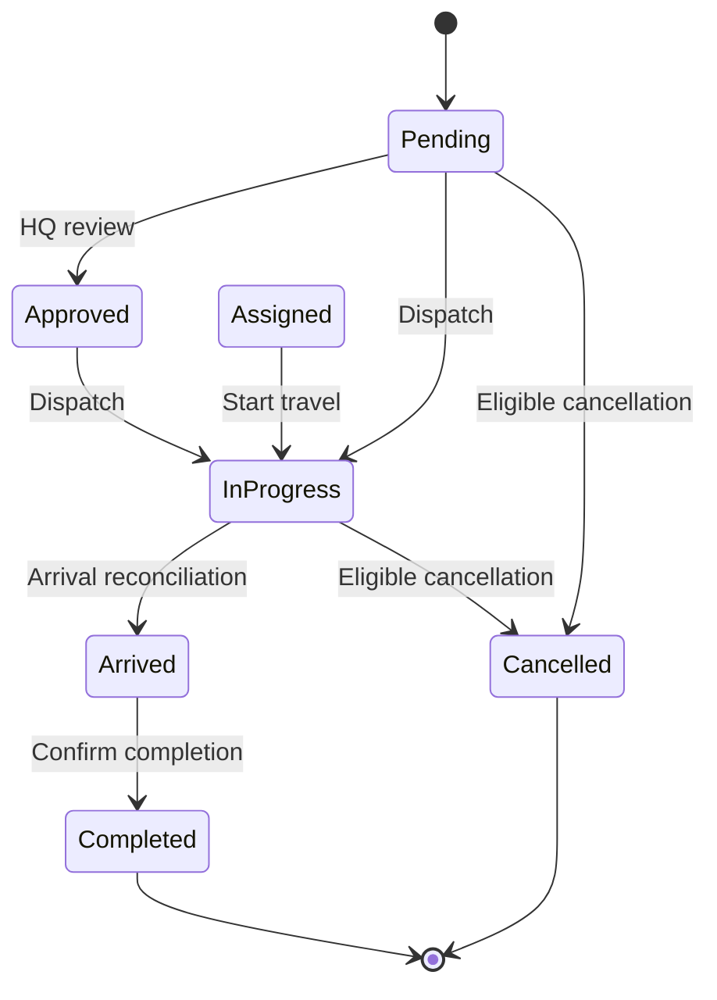

# Ambulance coordination, tracking and lifecycle

## 1. Account, ambulance and mission

Three records have separate meanings:

| Entity | Collection | Purpose |
| --- | --- | --- |
| Registered driver | `users` | Identity, contact, active state and employee role |
| Ambulance unit | `employees` | Vehicle, linked personnel, location, availability and current incident |
| Assignment claim | `driver_links` | Unique driver-to-unit relationship |

A driver's registration does not create a vehicle. HQ creates or selects the unit and establishes its assignment through a transaction.

## 2. Unit creation and driver assignment

HQ opens Fleet operations, selects an active registered driver and creates a unit or chooses an eligible existing one. Vehicle plate/model and center association describe the inventory record. The parking location is chosen on a map.

The assignment transaction checks the account, existing claim and unit state. It then writes the link and unit association together. Registered profile data supplies driver name and phone.

A busy unit remains protected during its current response. This prevents vehicle reassignment from disconnecting an active mission.

## 3. Availability states

- `available`: ready for dispatch through the operational workflow.
- `busy`: reserved for its active incident.
- `offline`: excluded from available-unit selection.

The unit's `activeRequestId` carries the current mission relationship. Availability counters come from unit records rather than user-registration totals.

## 4. Queue selection and dispatch

The queue considers request priority, review state and eligible units. RouteService supplies road geometry and travel context for a selected incident/unit pair.

The dispatch transaction re-reads the pair and checks that both remain eligible. It writes the incident assignment and unit reservation together. Competing HQ sessions must re-evaluate the new cloud state.

If no unit is available, the request stays queued. Releasing a unit permits queued work to be considered again.

## 5. Incident lifecycle

The model supports `Assigned` as well as direct dispatch into `InProgress`. The diagram illustrates the principal workflow; cancellation eligibility applies across the supported open states under the server policy.

## 6. Shared journey records

A journey is identified by the unit ID and linked to the request ID. It stores road points, start time, duration, speed factor and pause/stop state.

RoutePlayback computes cumulative segment distances, then locates the corresponding position and heading along the path. Clients consuming the same record use the same inputs for their map view.

HQ controls journey settings. An authorized citizen or assigned driver can also reconcile arrival five seconds after the saved journey endpoint, without an admin session. Server-time rules check the complete transaction. Citizen and driver reads are scoped to the associated mission. Pausing freezes progress; a terminal stop freezes the final state. An optional Cloud Tasks worker supports arrival while all clients are closed; see [arrival and administration updates](ARRIVAL_ADMIN_AND_CHATBOT_UPDATES.md).

The map view and the availability state are coordinated but distinct: arrival does not free a unit by itself.

## 7. Completion

The completion operation reads the incident and unit together. It requires the appropriate arrived state and current assignment relationship.

The transaction updates the incident to Completed, releases the unit to available, clears the active request, sets speed to zero and stops the relevant journey.

Repeated completion is handled safely. A stale request cannot clear a unit already associated with another mission. The non-HQ write path is additionally checked by Firestore rules for ownership/assignment and related-record changes.

## 8. Cancellation

The citizen's eligible cancellation action follows the original request creation timestamp. Assignment does not restart eligibility.

The transaction changes the incident to Cancelled, updates usage accounting, releases the unit if it still serves that incident and freezes the relevant journey. Rules check the allowed fields, owner, cloud request time and related after-state.

The usage record and incident transition are linked. Direct client writes cannot independently reset the cancellation history or free an unrelated unit.

## 9. Map-based patient and parking locations

Citizens select the patient point from current location or a map pin. HQ selects the ambulance staging point by dropping a pin. Road alignment helps place staging points on the drivable network.

RequestLocation and Employee validate coordinate ranges for service use. Human-readable addresses accompany coordinates where available.

## 10. Implementation and checks

Sources: [FirestoreService](../lib/services/firestore_service.dart), [Employee](../lib/models/employee.dart), [EmergencyRequest](../lib/models/emergency_request.dart), [RoutePlayback](../lib/models/route_playback.dart), [RouteService](../lib/services/route_service.dart), [rules](../firestore.rules).

Checks cover queue ordering, eligible-unit selection, account linking, busy-unit protection, shared route progress, terminal release and stale-assignment safety. [Acceptance testing](ACCEPTANCE_TESTING_REPORT.md) lists the suites and recorded results.
